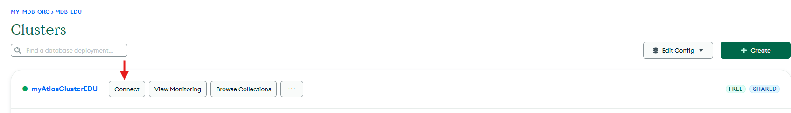
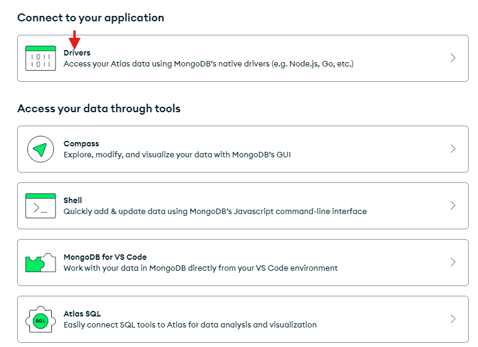
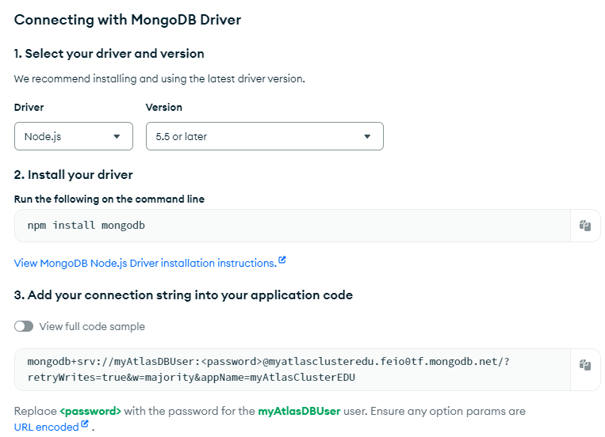
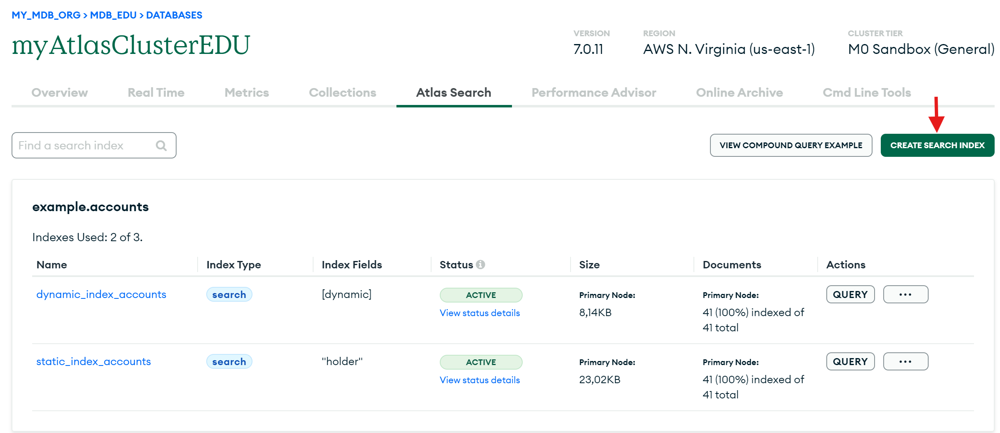
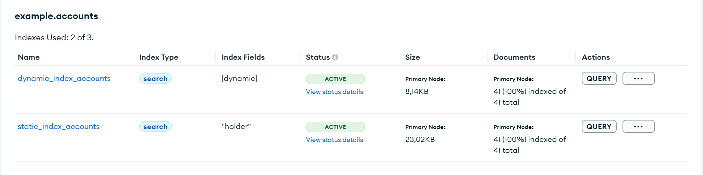

# MongoDB – how to start in Node.js

## Connection to a Database in Atlas
1. Log on https://cloud.mongodb.com/.
2. Choose database and select „Connect”.
   
3. Add the user who will be used to connect to the database and add his IP address to the access list.
4. The next step is to choose the connection method. Select Drivers
   
5. Select version, install mongodb with npm and copy connection string
   

This JavaScript code is designed to manage a connection to a MongoDB database using the MongoDB Node.js driver. Initially, it creates a new instance of MongoClient with a provided URI, which typically includes information about the database location and credentials. It then defines an asynchronous function, connectToDatabase, which attempts to establish a connection to the database using await client.connect(). If the connection is successful, it logs the message "Connected to DB"; if an error occurs, it catches the error and logs an appropriate message.

The main function, main, orchestrates the entire connection process. It calls connectToDatabase to establish the connection, handles any errors that may occur, and ensures the client is closed using await client.close() in the finally block. This is crucial for releasing resources and avoiding potential memory leaks or open connections. Finally, main() is invoked to execute the whole process. This code effectively manages the lifecycle of a MongoDB connection by handling the connection, error handling, and proper closure of the connection within an asynchronous context.
```javascript
const {MongoClient} = require("mongodb")

const client = new MongoClient(<connection_string>);
    
const connectToDatabase = async () => {
    try {
        await client.connect()
        console.log("Connected to DB")
    } catch (err) {
        console.log(`Error during connection to DB: ${err}`)
    }
}

const main = async () => {
    try {
        await connectToDatabase();
    } catch (err) {
        console.log(`Error during connection to DB: ${err}`);
    } finally {
        await client.close();
    }
};
    
main()
```

An application should use only one MongoClient instance for all request. This will help avoid performance issues because creating MongoClient instances is costly.


## CRUD operations

### Insert a document
You can add a document to a collection using the collection.insertOne() method. To do this, create an object containing the fields and values you want to store. If the collection doesn't already exist, the insertOne() method will create it for you.
If we do not specify the _id field, the driver will automatically generate a unique ID.

There is also possibility to add multiple documents to a collection using the collection.insertMany() method. This method takes an array of documents that you want to insert into the specified collection.
Additional options can be specified using the options object, which is passed as the second parameter to the insertMany() method. For example, setting ordered:true will stop the insertion process if any document in the array fails to be inserted.
Providing incorrect parameters for the insertMany() operation can lead to issues. For instance, trying to insert a field with a value that violates unique index rules will result in a duplicate key error.

Example:
```javascript

//Document to add
const account = {
        holder: "John Random",
        id: "UUS3434ODPS",
        type: "Private",
        balance: 1323.23
}
//Array of documents to add
const accounts = [{
        holder: "Michael Random",
        id: "UGGF3423ODPS",
        type: "Private",
        balance: 123.23
    }, {
        holder: "Mick Happy",
        id: "UGGF3423OGGDS",
        type: "Private",
        balance: 1000
}]

const main = async () => {
    try {
        // Execute insert operation of one document and log result
        let resultOneInserted = await accountsCollection.insertOne(account);
        console.log(`Inserted: ${resultOneInserted.insertedId}`);


        // Prevent additional documents from being inserted if one fails
        const options = { ordered: true };
        
        // Execute insert operation of many documents and log result
        let resultManyInserted = await accountsCollection.insertMany(accounts, options);
        console.log(`Inserted: ${resultManyInserted.insertedCount} documents.`);
        
    } catch (err) {
        console.log(`Error during insertion to DB: ${err}`);
    } finally {
        // Close connection
        await client.close();
    }
};
```

### Query a document
You can retrieve multiple documents from a collection using the collection.find() method. This method utilizes a query document that you supply to identify the subset of documents in the collection that match the criteria.
If you don't provide a query document or if you provide an empty one, MongoDB will return all documents in the collection.
It is also possible to use The findOne() operation which only returns the first matched document.

You can also set additional query options, like sorting and projection, to customize the result set. These options can be specified in the options parameter of your find() or findOne() method call, using sort and projection objects.

Example:
```javascript
const main = async () => {
    try {
        const options = {
            // Sort returned documents in ascending order by balance
            sort: { balance: 1 },
            // Include only the `holder` and `balance` fields in each returned document
            projection: { _id: 0, holder: 1, balance: 1 },
        };

        //Query collection
        let result = accountsCollection.find({balance: {$gt: 1500}}, options)
        
        console.log("Found documents:")
        for await (const doc of result) {
            console.log(doc);
        }

        //Read only first found document
        let resultOne = await accountsCollection.findOne({_id: new ObjectId("668c399bc90d00061f4959c9")}, options)
        console.log(resultOne);

    } catch (err) {
        console.log(`Error during find: ${err}`);
    } finally {
        await client.close();
    }
};
```
### Update a document
A single document can be updated using the collection.updateOne() method.
This method requires two main parameters: a filter document and an update document.
The filter document specifies which document(s) in the collection should be updated based on certain criteria.
The update document contains instructions, using update operators, on how the matched document(s) should be modified—indicating which fields and values should be changed.
If the filter matches any documents in the collection, the updateOne() method applies the specified updates according to the instructions provided in the update document.

Example update operators:

* $inc - Increments the value of the field by the specified amount.
* $set - Sets the value of a field in a document.

* $push - Adds an item to an array.
* $pull - Removes all array elements that match a specified query.

To update multiple documents, the process is very similar to updateOne(), but you use the collection.updateMany() method. The updateMany() method takes a filter document and an update document. If the filter matches any documents in the collection, the method applies the updates specified in the update document to the fields and values of those documents. The update document must include an update operator to modify a field in the documents.

You can include additional query options by using the options object as the second parameter in the updateOne() or updateMany() method.
For example using the upsert option to true allows the method to create a new document if no existing documents match the specified filter criteria.
For more information about options visit official documentation.

Example:
```javascript
const main = async () => {
    try {
        // Create a filter for account with the holder "John Random"
        const docToUpdate = { holder: "John Random" }

        // Specify the update to increment balance
        const update = {$inc: {balance: 100}};

        // Set the upsert option to insert a document if no documents match the filter
        const options = { upsert: true };

        //update one document
        let updateResult = await accountsCollection.updateOne(docToUpdate, update, options);
        console.log(`${updateResult.matchedCount} document(s) matched the filter, updated ${updateResult.modifiedCount} document(s)`);

        //update many documents
        let updateManyResult = await accountsCollection.updateMany(docToUpdate, update, options);
        console.log(`${updateManyResult.matchedCount} document(s) matched the filter, updated ${updateManyResult.modifiedCount} document(s)`);


    } catch (err) {
        console.log(`Error during update: ${err}`);
    } finally {
        await client.close();
    }
};
```
Result:
```bash
Connected to DB
1 document(s) matched the filter, updated 1 document(s)
12 document(s) matched the filter, updated 12 document(s)
```

### Delete a document

You can remove a single document from a collection using the collection.deleteOne() method.
This method takes a query document to identify the specific document(s) to delete. If you don't provide a query document or provide an empty one, MongoDB will match all documents in the collection and delete the first one it finds. You can also use collection.deleteMany() to remove all matching collections.

```javascript
const main = async () => {
    try {
        ///Delete document
        const docToDelete = { holder: "John Random" }

        /* Delete the first document in the "accounts" collection that matches
            the specified query document */
        let deletionResult = await accountsCollection.deleteOne(docToDelete)
        deletionResult.deletedCount === 1 ? console.log('Document deleted') : console.log('Document not deleted');

        /* Delete all documents in the "accounts" collection that matches
            the specified query document */
        let deletionManyResult = await accountsCollection.deleteMany(docToDelete)
        console.log(`${deletionManyResult.deletedCount} documents matched filter and were deleted` )


    } catch (err) {
        console.log(`Error during deletion: ${err}`);
    } finally {
        await client.close();
    }
};
```

## Aggregation Pipelines
Aggregation operations in MongoDB are expressions used to generate reduced and summarized results. MongoDB's aggregation framework enables the creation of a pipeline composed of multiple stages, where each stage performs a specific operation on the data.
Aggregations consist of multiple stages, which can be found here: [Aggregation Pipeline Stages](https://www.mongodb.com/docs/manual/reference/operator/aggregation-pipeline/). Here will be presented a few examples of how some of these stages can be used.
### $match
The `$match` stage filters documents based on criteria specified in the query document. For example, `$match: { author: "Dave" }` performs a simple equality match, while `$match: { likes: { $gt: 100 } }` uses a comparison operator to filter documents.
The resulting documents are then passed to the next stage. It's best to place `$match` early in the pipeline to minimize the number of documents processed in subsequent stages.
### $group
The `$group` stage separates documents according to a group key and returns one document for every unique group key.
The group key is usually a field in the document, but it can also be an expression that resolves to a field. The `$group` stage can be used with aggregation expressions to perform calculations on the grouped documents.

An example of this is adding up the total number of movie tickets sold by using the `$sum` operator:

`$group:{ _id: "$movie", totalTickets: { $sum: "$tickets" } }`

The `$movie` is the group key, and the totalTickets field is the result of the `$sum` operator.

### $sort
The `$sort` stage takes all the input documents and sorts them in a specific order. The documents can be sorted in numerical, alphabetical, ascending, or descending order.

The `$sort` stage accepts a sort key that specifies the field to sort on. The sort key can be 1 for ascending order or -1 for descending order. For example:

`{ $sort: { balance: 1 } }` sorts the documents in ascending order by the balance field.

`{ $sort: { balance: -1 } }` sorts the documents in descending order by the balance field.


### $project
The `$project` stage processes all input documents and forwards only a specified subset of fields, allowing you to include or exclude certain fields.

For instance, to have the resulting documents show only the account_id, you would use `{ $project: { _id: 0, account_id: 1 } }`. Here, the `_id` field is excluded by setting it to 0, while the `account_id` field is included by setting it to 1.

Moreover, the `$project` stage can create new computed fields based on the existing data in the original documents. For example, you could create a new field that combines the first and last names stored separately in the original document to form a full name.

Example:
```javascript
const main = async () => {
    try {
        const pipeline = [
            //Filters documents where the balance is greater than or equal to 1000.
            {
                $match: {
                    balance: { $gte: 1000 }
                }
            },
            //Sorts the documents by balance in descending order.
            {
                $sort: { balance: -1 }
            },
            //Includes only the id, type, balance, holder, and calculates a new field gbp_balance
            {
                $project: {
                    _id: 0,
                    id: 1,
                    holder: 1,
                    type: 1,
                    balance: 1,
                    gbp_balance: { $multiply: ['$balance', 0.74] } // Assuming conversion rate of 1 USD to 0.74 GBP
                }
            },
            /*Groups the documents by type, calculates the total balance for each account type,
             and creates an array of accounts with their IDs, balances, and GBP balances.*/
            {
                $group: {
                    _id: "$type",
                    total_balance: { $sum: "$balance" },
                    total_gbp_balance: { $sum: "$gbp_balance" }
                }
            }
        ];

        //RESULT
        const results = await accountsCollection.aggregate(pipeline).toArray();

        console.log("Aggregation Results:");
        console.log(results);


    } catch (err) {
        console.log(`Error during aggregation: ${err}`);
    } finally {
        await client.close();
    }
};
```
## Change streams
Change streams enable you to get notifications about alterations in your MongoDB databases and collections. With change streams, you can set up automated actions that trigger whenever a change event happens.
Since change streams use the aggregation framework, you have the option to filter specific change events or modify the documents that describe these events.

We can handle change streams in MongoDB using EventEmitter's on(), ChangeStream's hasNext(), and the Stream API. Here, we will demonstrate an example using the Stream API.

```javascript
// Function to close stream after certain amount of time.
function closeChangeStream(timeInMs = 60000, changeStream) {
    return new Promise((resolve) => {
        setTimeout(() => {
            console.log("Closing the change stream");
            resolve(changeStream.close());
        }, timeInMs)
    });
}

// Change stream function.
async function monitorListingsUsingEventEmitter(client, timeInMs = 60000, pipeline = []){

    // Creation of change stream
    const changeStream = accountsCollection.watch(pipeline);

    /* Here we monitor our change stream. ChangeStream's stream() will return a Node Readable stream.
    Pipe() is called to pull the data out of the stream and write it to the console.*/
    changeStream.stream().pipe(
        new stream.Writable({
            objectMode: true,
            write: function (doc, _, cb) {
                console.log(doc);
                cb();
            }
        })
    );


    // Close stream
    await closeChangeStream(timeInMs, changeStream);
}

const main = async () => {
    try {
        await monitorListingsUsingEventEmitter(client);
    } catch (err) {
        console.log(`Error during stream change: ${err}`);
    } finally {
        await client.close();
    }
};
```

### Change Stream performance

If the number of active change streams on a database surpasses the connection pool size,
you might encounter delays in notifications.
Each change stream occupies a connection and continuously performs a getMore operation while waiting for the next event. To prevent latency issues, ensure that the connection pool size exceeds the number of active change streams. For more information, refer to the maxPoolSize setting.

### Change Stream resume
Each change stream event document includes a resume token, which the Node.js driver automatically stores in the _id field of the change event document. When creating a new change stream, the application can pass this resume token to ensure the stream includes all events that occurred after the event associated with that token.

The MongoDB Node.js driver will try to reestablish connections automatically during transient network errors or elections, using its cached copy of the most recent resume token to avoid losing any change stream events.
However, if the application fails or restarts, it needs to provide the resume token when creating a new change stream to ensure no events are missed.
Note that the driver's cached copy of the resume token is lost when the application restarts, so the application should store the resume token itself.

### Change Stream Enchancer (Java)

gravity9 created a library that helps manage MongoDB Change Streams. So far, only Java version is avaiable. Mongo Change Stream Enhancer divides Change Stream events into partitions and enables you to handle them in separate Threads, increasing throughput. It achieves that by creating a Change Stream per each partition (number is configurable) and handling each Change Stream in a dedicated Thread.


[Change Stream Enchancer (Java) GitHub](https://github.com/gravity9-tech/mongo-cse)

### Change Stream with aggregation
In certain situations, you might not be interested in every change event happening in a collection. Instead, you may want to focus on specific changes. You can use an aggregation pipeline to filter these changes or to transform the change stream event documents. In example below we want to filter only event with balance greater than 1000.

```javascript
// Function to close stream after certain amount of time.
function closeChangeStream(timeInMs = 60000, changeStream) {
    return new Promise((resolve) => {
        setTimeout(() => {
            console.log("Closing the change stream");
            resolve(changeStream.close());
        }, timeInMs)
    });
}


const pipeline = [
    //Filters documents where the balance is greater than or equal to 1000.
    {
        $match: {
            operationType: 'insert',
            'fullDocument.balance': {$gt: 1000}
        }
    }
]


// Change stream function.
async function monitorListingsUsingEventEmitter(client, timeInMs = 60000, pipeline = []) {

    // Creation of change stream
    const changeStream = accountsCollection.watch(pipeline);

    /* Here we monitor our change stream. ChangeStream's stream() will return a Node Readable stream.
    Pipe() is called to pull the data out of the stream and write it to the console.*/
    changeStream.stream().pipe(
        new stream.Writable({
            objectMode: true,
            write: function (doc, _, cb) {
                console.log(doc);
                cb();
            }
        })
    );


    // Close stream
    await closeChangeStream(timeInMs, changeStream);
}

const main = async () => {
    try {
        await monitorListingsUsingEventEmitter(client, 30000, pipeline);
    } catch (err) {
        console.log(`Error DB: ${err}`);
    } finally {
        await client.close();
    }
};
```

## Atlas Search
Atlas Search is a comprehensive text search solution integrated within MongoDB Atlas.
Utilizing Apache Lucene, the powerful engine also used by popular search platforms like Elasticsearch, Atlas Search offers advanced text search features directly within MongoDB. These features include full-text search, fuzzy matching, filtering, highlighting, faceting, and many other capabilities.

In order to use Atlas Search, it is necessary to create a search index.
This can be done from the Atlas interface or by Atlas API.
There are two types of indexes:
* search index with dynamic mapping(Default) - all fields indexed except booleans, objectIds and timestamps.
* search index with static mapping - certain fields indexed

To create a search index:

Navigate to the MongoDB Atlas dashboard.
1. Go to your database.
2. Select Atlas search.
3. Go on the “Create a Search Index” button and follow the prompt.
   


### Usage of Atlas Search in Node.js.
```javascript
const main = async () => {
    try {
        const pipeline = [
            //Search accounts documents to find "Private" String. Use dynamic mapping index to index all fields
            {
                $search: {
                    index: "dynamic_index_accounts",
                    text: {
                        query: "Private",
                        path: {
                            wildcard: "*"
                        }
                    }
                }
            }
        ];

        const pipelineStatic = [
            //Search accounts documents to find "Private" String. Use static mapping index to index only certain fields.
            {
                $search: {
                    index: "static_index_accounts",
                    text: {
                        query: "Private",
                        path: {
                            wildcard: "*"
                        }
                    }
                }
            }
        ];


        //RESULT
        const results = await accountsCollection.aggregate(pipeline).toArray();
        const resultsStatic = await accountsCollection.aggregate(pipelineStatic).toArray();

        console.log("Dynamic Search aggregation Results:");
        console.log(results);

        console.log("Static Search aggregation Results:");
        console.log(resultsStatic);


    } catch (err) {
        console.log(`Error during search: ${err}`);
    } finally {
        await client.close();
    }
};
```
The first pipeline, pipeline, is configured to perform a dynamic index search using the `$search` stage with the dynamic_index_accounts index.
This search looks for documents containing the string "Private" across all fields.

The second pipeline, pipelineStatic, is similarly configured but uses a static index called static_index_accounts. Regarding configuration below this index search only in `holder` field.


## Transactions
The driver offers two ways to perform transactions: the Core API and the Convenient Transaction API.
The Core API provides a framework for manually creating, committing, and ending transactions. When using this API, you need to explicitly handle the following tasks:
* Create, commit, and end the transaction.
* Create and end the session in which the transaction runs.
* Implement error-handling logic.

To implement transactions with Core API it is needed to use:

`startSession()`: creates a new ClientSession

`startTransaction()`: starts a new transaction

`commitTransaction()`: commits the active transaction in the session that it was created in

`abortTransaction()`: ends the active transaction in the session that it was created in

`endSession()`: ends the active session

```javascript
async function transaction(client) {
    const session = client.startSession();
    try {
        // Start transaction
        session.startTransaction();

        // Update document in accounts collection
        const accountsColl = client.db("bank").collection("accounts");
        await accountsColl.findOneAndUpdate(
            {
                id: "UUS3434ODPS"
            },
            {
                $inc: {balance: 100}
            });

        // Add new document to transactions collection
        const transactionsColl = client.db("bank").collection("transactions");
        await transactionsColl.insertOne(
            {
                id: uuidv4(),
                amount: 100
            }
        );

        // Commit transaction
        await session.commitTransaction();
        console.log("Transaction committed.");
    } catch (error) {
        console.log("An error occurred during the transaction:" + error);
        await session.abortTransaction();
    } finally {
        await session.endSession();
    }
}

```


The Convenient Transaction API, on the other hand, simplifies the process by managing the committing and ending of transactions for you. This API also includes built-in error-handling logic that retries operations if the server encounters certain errors.

The Convenient Transaction API offers the following methods for implementing transactions:

`withSession()`: This method runs the provided callback within a session, automatically managing the creation and termination of the session for you.

`withTransaction()`: This method runs the provided callback within a transaction and calls the commitTransaction() method once the callback completes.

Both methods return the value produced by the callback. For instance, if the callback provided to withTransaction() returns the document { hello: "world" }, then withTransaction() will also return that document.

Using the Convenient Transaction API allows you to propagate the return values from the callback, enabling the returned values from withTransaction() and withSession() to be used elsewhere in your code.

```javascript
async function transaction(client) {
    let txnRes = await client.withSession(async (session) =>
        session.withTransaction(async (session) => {
            const accountsColl = client.db("bank").collection("accounts");
            await accountsColl.findOneAndUpdate({
                    id: "UUS3434ODPS"
                },
                {
                    $inc: {balance: 100}
                });

            const transactionsColl = client.db("bank").collection("transactions");
            await transactionsColl.insertOne(
                {
                    id: uuidv4(),
                    amount: 100
                }
            );

            return "Transaction committed.";
        }, null)
    );
    console.log(txnRes);
}
```